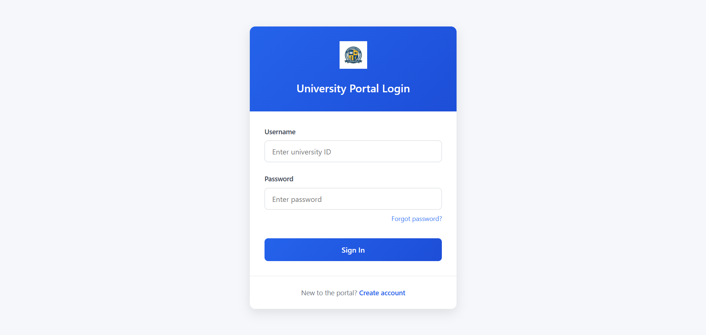
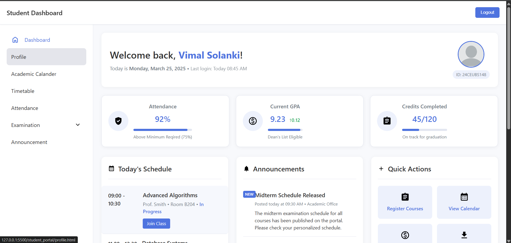

# 🎓 University Student Dashboard (Static UI)

This is a **static front-end project** for a University Management System – **Student Dashboard**. It’s designed using **HTML, CSS**, and a little **JavaScript** to demonstrate the layout and UI behavior of a student portal within a university system.

---

## 🌐 Live Preview

You can view the student dashboard UI by visiting the following link:

🔗 [Live Demo](https://vimalsolanki2006.github.io/UMS/)  

---

## 🔐 Login Credentials

Use the following credentials to log in:

- **Username**: `student`  
- **Password**: `student123`

> Note: This is a static UI. Login fields do not perform real authentication.

---

## 📁 Project Structure

```
├── css/
│   ├── student/
│   │   ├── announcement.css
│   │   ├── attendance.css
│   │   ├── calender.css
│   │   ├── exam_result.css
│   │   ├── exam_schedule.css
│   │   ├── profile.css
│   │   └── timeTable.css
│   ├── index.css
│   ├── login.css
│   ├── register.css
│   └── dashboard.css
├── images/
│   ├── logo.jpg
│   └── Profile.png
├── js/
│   ├── app.js
│   ├── calender.js
│   ├── exam_result.js
│   ├── exam_schedule.js
│   ├── login.js
│   └── profile.js
├── student_portal/
│   ├── announcement.html
│   ├── attendance.html
│   ├── calender.html
│   ├── exam_result.html
│   ├── exam_schedule.html
│   ├── profile.html
│   └── Time_Table.html
├── index.html
├── register.html
└── dashboard.html
```

---

## 🚀 Features

- 📋 **Static Front-End Only** – No backend or database integration
- 📱 **Responsive Layout** using media queries
- 🔄 **Reusable CSS Structure** for consistency across pages
- 🧾 **Individual Sections** for:
  - Student Profile
  - Attendance
  - Announcements
  - Exam Results
  - Exam Schedule
  - Calendar
  - Timetable
- 📂 Clean folder structure with separate files for each component

---

## 📸 Screenshots

### 🎯 Landing Page view


### 🎯 Student Dashboard View



---

## 💡 How to Use

1. Clone or download the repository:
   ```bash
   git clone https://github.com/vimalsolanki2006/UMS.git
   ```
2. Open any HTML file in a browser (e.g., `index.html` or `student.html`).
3. Navigate between pages using available buttons or manually through the file structure.

> ⚠️ No backend functionality. This is strictly UI/UX front-end only.

---

## 🛠️ Tools Used

- **HTML5**
- **CSS3**
- **JavaScript** (Vanilla, for minor interactivity)

---

## 📚 Future Enhancements

- Integrate with a backend (PHP, Node.js, etc.)
- Add real authentication & database connectivity
- Make it a full-stack CRUD-based system

---

## 📌 Author

- 🔗 GitHub: [vimalsolanki2006](https://github.com/vimalsolanki2006)
- 🏫 Student, DDU College – Computer Engineering
